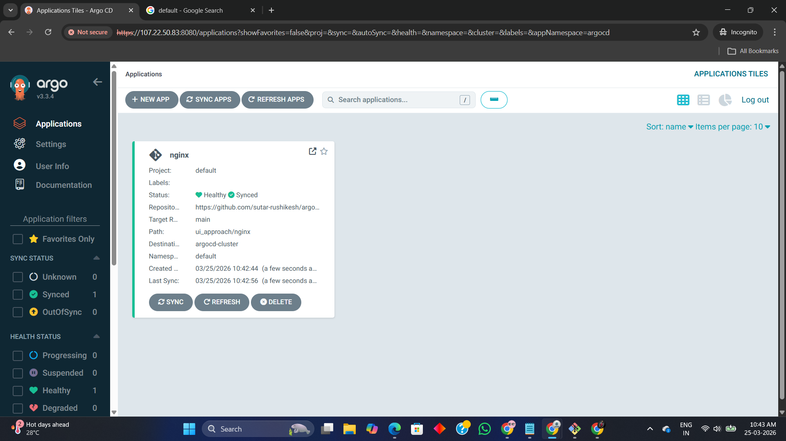
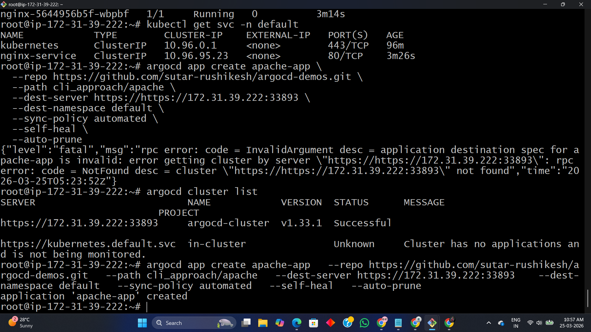
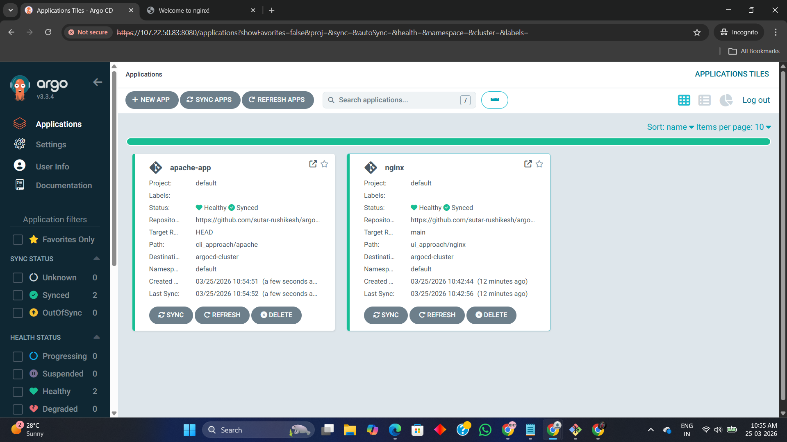
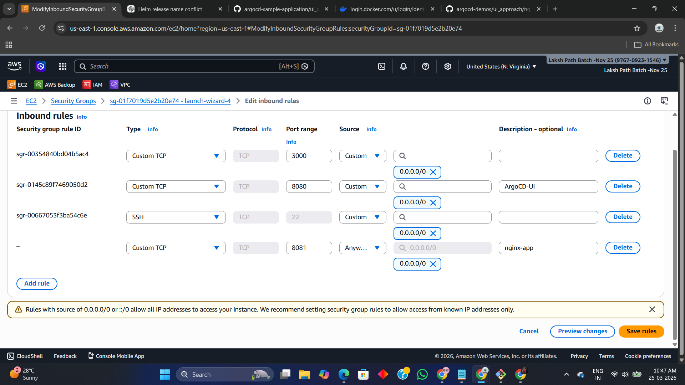
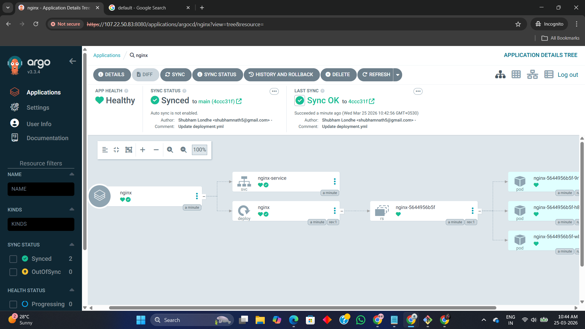
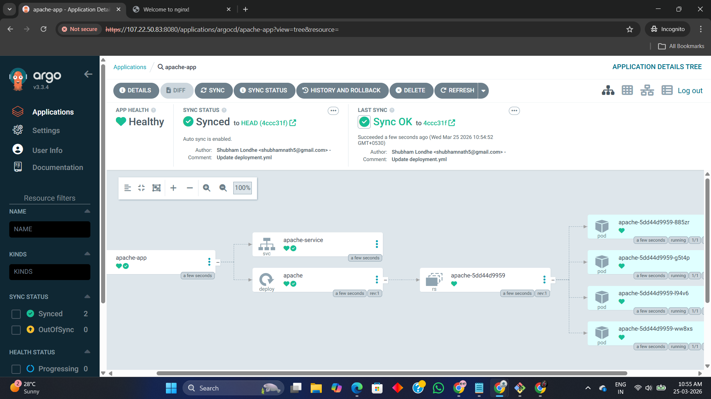
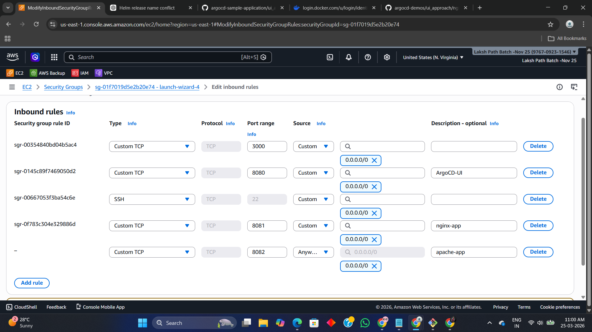
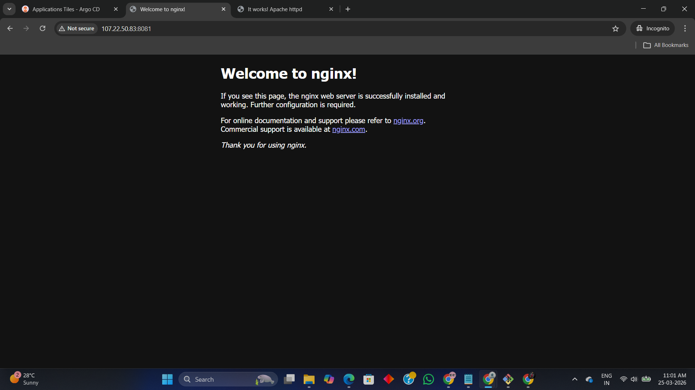
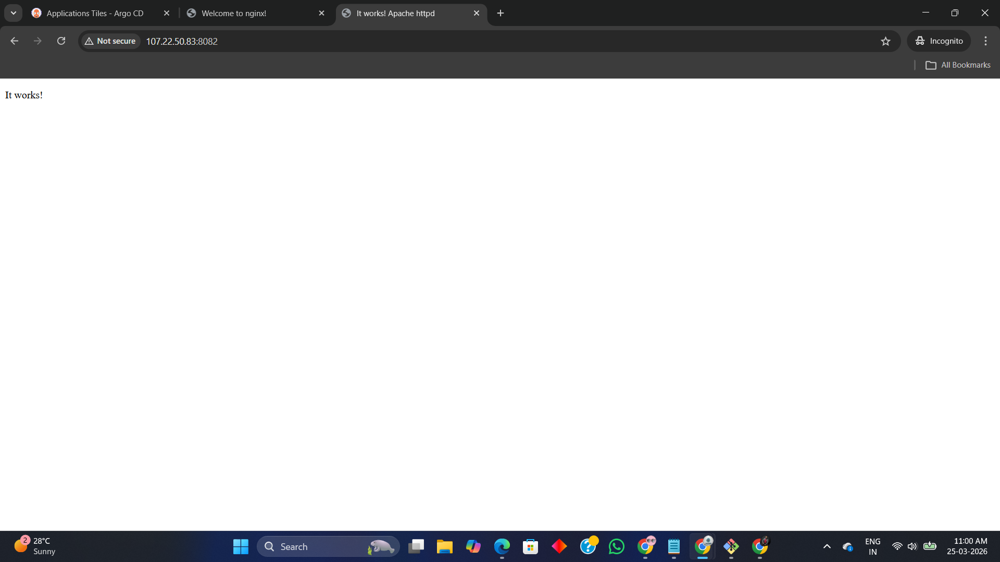

# 🚀 ArgoCD Application Deployment using GitOps

------------------------------------------------------------------------

<p align="center">  </p> <p align="center"> <b>GitOps Continuous Delivery for Kubernetes using ArgoCD</b> </p>

# 📌 Overview

------------------------------------------------------------------------

This project demonstrates end-to-end application deployment on Kubernetes using ArgoCD following GitOps principles.

It includes:

🔹 UI-based Deployment (NGINX)

🔹 CLI-based Deployment (Apache)

🔹 Declarative GitOps Deployment (Best Practice)


👉 The goal is to show real DevOps workflow:


Git → ArgoCD → Kubernetes (Auto Sync & Self-Heal)


🧠 What is ArgoCD?


ArgoCD is a declarative GitOps continuous delivery tool for Kubernetes that:

Tracks Git repositories
Compares desired vs actual state
Automatically syncs applications to cluster

🔄 What is GitOps?


GitOps means:


👉 Git = Single Source of Truth

All configs stored in Git
Any change in Git → auto deployed
Ensures consistency & auditability


# 🏗️ Architecture


🔍 Flow
Developer pushes code to GitHub
ArgoCD monitors repository
Detects changes in manifests
Syncs with Kubernetes cluster
Ensures cluster state = Git state

# ⚙️ Prerequisites

Installed Kind
Created cluster:

Follow to create ArgoCD setup: 
https://github.com/sutar-rushikesh/argocd-kind-setup.git

Kubernetes Cluster (Kind / EKS / AKS)

ArgoCD installed

kubectl configured

GitHub repository with manifests

ArgoCD CLI

# 🚀 Implementation


🔹 1. UI-Based Deployment (NGINX)

📌 Steps

Login to ArgoCD UI

Click New Application

Configure:

Repo URL

Path: ui_approach/nginx

Cluster & Namespace

👉 Result
### 📷 UI Application Created

<p align="center">
  
</p>

App created manually

Requires manual sync

⚠️ Not GitOps compliant

🔹 2. CLI-Based Deployment (Apache)


📌 Command

``` bash
argocd app create apache-app \
  --repo https://github.com/sutar-rushikesh/argocd-demos.git \
  --path cli_approach/apache \
  --dest-server https://<cluster-endpoint> \
  --dest-namespace default \
  --sync-policy automated \
  --self-heal \
  --auto-prune
```
<p align="center">
  
</p>

📷 Output

<p align="center">
  
</p>

# 📌 Key Features


Feature	Description
Auto Sync	Deploys automatically
Self Heal	Fixes manual changes
Auto Prune	Deletes unused resources


👉 Faster but still partially manual


🔹 3. Declarative GitOps Deployment ✅

📌 Application YAML

``` bash
apiVersion: argoproj.io/v1alpha1
kind: Application
metadata:
  name: nginx-app
spec:
  destination:
    namespace: default
    server: https://kubernetes.default.svc
  source:
    repoURL: https://github.com/sutar-rushikesh/argocd-demos.git
    path: declarative/nginx
    targetRevision: HEAD
  syncPolicy:
    automated:
      prune: true
      selfHeal: true

```
<p align="center">


</p>  

📌 Apply

``` bash
kubectl apply -f application.yaml
```

👉 Fully automated GitOps approach
<p align="center">
  
</p>


# 📊 Deployment Results


🔹 Applications Dashboard
<p align="center">
  
</p>

🔹 NGINX Deployment Tree
<p align="center">
  
</p>

🔹 Apache Deployment Tree
<p align="center">
  
</p>

🌐 Application Access
To access the UI Kindly open the ports from security group in your instance

<p align="center">
  
</p>

Application	URL

NGINX	http://EC2-IP:8081

Apache	http://EC2-IP:8082

📷 NGINX
<p align="center">
  
</p>

📷 Apache
<p align="center">
  
</p>


# 🧪 Testing (Real DevOps Use Cases)


🔹 Test 1: Auto Sync
Update replicas in Git
Commit changes
ArgoCD auto syncs

👉 Pods scale automatically

🔹 Test 2: Self-Healing

``` bash
kubectl delete pod <pod-name>
```
👉 ArgoCD recreates pod automatically


# 🔁 Key Features Demonstrated


✅ GitOps Workflow
✅ Auto Sync
✅ Self-Healing
✅ Drift Detection
✅ Auto Pruning

# 🧾 Common ArgoCD Commands


Command	Description

``` bash
argocd login <server>	Login
argocd app list	List apps
argocd app get <app>	Details
argocd app sync <app>	Sync
argocd app delete <app>	Delete
argocd cluster list	Clusters
```
# ⚠️ Issue Faced & Fix


❌ Error
InvalidSpecError: cluster not found
✅ Fix
Corrected cluster endpoint
Verified using:
argocd cluster list

# 📚 Key Learnings


Difference: Imperative vs Declarative
Real GitOps workflow
ArgoCD architecture understanding
Kubernetes deployment automation
Production-ready approach

# 🧨 Cleanup

``` bash
kind delete cluster --name argocd-cluster 
```
# 👨‍💻 Author
------------------------------------------------------------------------

Rushikesh M.Sutar
